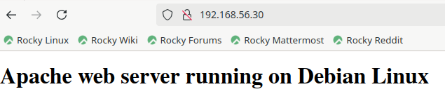
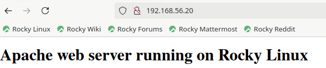
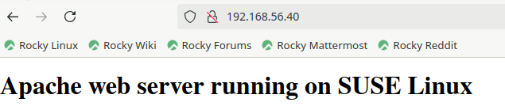

## Exercice 7
Je démarre les VM et me connecte au control host:

```bash
vagrant up
vagrant ssh ansible
```

Je me rends dans le répertoire du projet :

```bash
cd ansible/projets/ema/
direnv: loading ~/ansible/projets/ema/.envrc
direnv: export +ANSIBLE_CONFIG
ls -l
```
J'écris et je testes les 3 playbooks : 

Playbook `apache-debian` :

```yaml
---  # apache-debian.yml

- hosts: debian

    tasks:
- name: Update package information
    apt:
update_cache: true
cache_valid_time: 3600

- name: Install Apache
    apt:
name: apache2

- name: Start & enable Apache
    service:
name: apache2
state: started
enabled: true

- name: Install custom web page
    copy:
dest: /var/www/html/index.html
mode: 0644
content: |
    <!doctype html>
    <html>
<head>
    <meta charset="utf-8">
    <title>Test</title>
</head>
<body>
    <h1>Apache web server running on Debian Linux</h1>
</body>
    </html>
```

J'exécute le playbook :

```bash
ansible-playbook apache-debian.yml
```
```bash
PLAY [debian] *******************************************************************************************************************************************

TASK [Gathering Facts] **********************************************************************************************************************************
ok: [debian]

TASK [Update package information] ***********************************************************************************************************************
changed: [debian]

TASK [Install Apache] ***********************************************************************************************************************
changed: [debian]

TASK [Start & enable Apache] ***********************************************************************************************************************
ok: [debian]

TASK [Install custom web page] ***********************************************************************************************************************
changed: [debian]

PLAY RECAP ***********************************************************************************************************************
debian                     : ok=5    changed=3    unreachable=0    failed=0    skipped=0    rescued=0    ignored=0  
```
et la 2ème fois : 
```bash
debian                     : ok=5    changed=0    unreachable=0    failed=0    skipped=0    rescued=0    ignored=0 
```

Playbook `apache-rocky.yml` :

```yaml

- hosts: rocky

  tasks:
    - name: Install Apache
      dnf:
        name: httpd

    - name: Start & enable Apache
      service:
        name: httpd
        state: started
        enabled: true

    - name: Install custom web page
      copy:
        dest: /var/www/html/index.html
        mode: 0644
        content: |
          <!doctype html>
          <html>
            <head>
              <meta charset="utf-8">
              <title>Test</title>
            </head>
            <body>
              <h1>Apache web server running on Rocky Linux</h1>
            </body>
          </html>
```

J'exécute le playbook :

```bash
ansible-playbook apache-rocky.yml
```
```bash
PLAY [rocky] ***********************************************************************************************************************

TASK [Gathering Facts] ***********************************************************************************************************************
ok: [rocky]

TASK [Install Apache] ***********************************************************************************************************************
changed: [rocky]

TASK [Start & enable Apache] ***********************************************************************************************************************
changed: [rocky]

TASK [Install custom web page] ***********************************************************************************************************************
changed: [rocky]

PLAY RECAP ***********************************************************************************************************************
rocky                      : ok=4    changed=3    unreachable=0    failed=0    skipped=0    rescued=0    ignored=0   
```
2ème fois 
```bash
rocky                      : ok=4    changed=0    unreachable=0    failed=0    skipped=0    rescued=0    ignored=0   
```

Playbook `apache-suse.yml` :

```yaml
- hosts: suse

    tasks:
- name: Install Apache
    zypper:
name: apache2

- name: Start & enable Apache
    service:
name: apache2
state: started
enabled: true

- name: Install custom web page
    copy:
dest: /srv/www/htdocs/index.html
mode: 0644
content: |
    <!doctype html>
    <html>
<head>
    <meta charset="utf-8">
    <title>Test</title>
</head>
<body>
    <h1>Apache web server running on SUSE Linux</h1>
</body>
    </html>
```

J'exécute le playbook :

```bash
ansible-playbook apache-suse.yml
```
```bash
PLAY [suse] ***********************************************************************************************************************

TASK [Gathering Facts] ***********************************************************************************************************************
ok: [suse]

TASK [Install Apache] ***********************************************************************************************************************
changed: [suse]

TASK [Start & enable Apache] ***********************************************************************************************************************
changed: [suse]

TASK [Install custom web page] ***********************************************************************************************************************
changed: [suse]

PLAY RECAP ***********************************************************************************************************************
suse                      : ok=4    changed=3    unreachable=0    failed=0    skipped=0    rescued=0    ignored=0   
```
2ème fois 
```bash
suse                      : ok=4    changed=0    unreachable=0    failed=0    skipped=0    rescued=0    ignored=0   
```

J'accède au sites web pour vérifier qu'ils se sont bien installés :
```bash
    cat /vagrant/hosts 
127.0.0.1      localhost.localdomain  localhost
192.168.56.10  ansible.sandbox.lan    ansible
192.168.56.20  rocky.sandbox.lan      rocky
192.168.56.30  debian.sandbox.lan     debian
192.168.56.40  suse.sandbox.lan       suse

```plaintext
http://192.168.56.30
http://192.168.56.20
http://192.168.56.40
```





Je quitte le control et supprime toutes les VM :

```bash
exit
vagrant destroy -f
```
