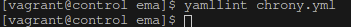

## Exercice 8

Je démarre les VM et me connecte au Control Host :

```bash
vagrant up
vagrant ssh control
```

Je me rends dans le répertoire du projet :

```bash
cd ansible/projets/ema/
ls -l
```
Je regarde comment est défini l'inventaire :
```bash
cat inventory
```
```bash
[redhat]
target01
target02
target03

[redhat:vars]
ansible_python_interpreter=/usr/bin/python3
ansible_user=vagrant
ansible_become=yes
```

J'écris le playbook **chrony.yml** :
```bash
vim chrony.yml
```
```bash
---  # chrony.yml

- hosts: redhat

  tasks:
    - name: Install chrony package
      dnf:
        name: chrony
        state: present

    - name: Start and enable chronyd service
      service:
        name: chronyd
        state: started
        enabled: true

    - name: Backup original chrony.conf
      command: mv /etc/chrony.conf /etc/chrony.conf.bak
      args:
        creates: /etc/chrony.conf.bak

    - name: Install custom chrony configuration
      copy:
        dest: /etc/chrony.conf
        content: |
          server 0.fr.pool.ntp.org iburst
          server 1.fr.pool.ntp.org iburst
          server 2.fr.pool.ntp.org iburst
          server 3.fr.pool.ntp.org iburst
          driftfile /var/lib/chrony/drift
          makestep 1.0 3
          rtcsync
          logdir /var/log/chrony

    - name: Restart chronyd service
      service:
        name: chronyd
        state: restarted
```

Je vérifie la syntaxe correcte de mon playbook chrony.yml :
```bash
yamllint chrony.yml
```

Pas d'erreur n'a été relevé donc j'imagine que la syntaxe est bonne !


Je l'exécute pour vérifier qu'il fonctionne bien:
```bash
ansible-playbook chrony.yml
```
```bash
PLAY [redhat] 
**************************************************************************************************************

TASK [Gathering Facts] **************************************************************************************************************
ok: [target01]
ok: [target03]
ok: [target02]

TASK [Install chrony package] **************************************************************************************************************
changed: [target02]
changed: [target01]
changed: [target03]

TASK [Start and enable chronyd service] **************************************************************************************************************
changed: [target03]
changed: [target02]
changed: [target01]

TASK [Backup original chrony.conf] **************************************************************************************************************
changed: [target03]
changed: [target01]
changed: [target02]

TASK [Install custom chrony configuration] **************************************************************************************************************
changed: [target03]
changed: [target01]
changed: [target02]

TASK [Restart chronyd service] **************************************************************************************************************
changed: [target01]
changed: [target02]
changed: [target03]

PLAY RECAP 
**************************************************************************************************************
target01                   : ok=6    changed=5    unreachable=0    failed=0    skipped=0    rescued=0    ignored=0   
target02                   : ok=6    changed=5    unreachable=0    failed=0    skipped=0    rescued=0    ignored=0   
target03                   : ok=6    changed=5    unreachable=0    failed=0    skipped=0    rescued=0    ignored=0   
```

Puis une 2ème fois afin d'être sûr que seul le redemarage du service change :
```bash
PLAY [redhat] 
**************************************************************************************************************

TASK [Gathering Facts] **************************************************************************************************************
ok: [target01]
ok: [target02]
ok: [target03]

TASK [Install chrony package] **************************************************************************************************************
ok: [target03]
ok: [target01]
ok: [target02]

TASK [Start and enable chronyd service] **************************************************************************************************************
ok: [target02]
ok: [target01]
ok: [target03]

TASK [Backup original chrony.conf] **************************************************************************************************************
ok: [target01]
ok: [target02]
ok: [target03]

TASK [Install custom chrony configuration] **************************************************************************************************************
ok: [target02]
ok: [target03]
ok: [target01]

TASK [Restart chronyd service] **************************************************************************************************************
changed: [target01]
changed: [target02]
changed: [target03]

PLAY RECAP 
**************************************************************************************************************
target01                   : ok=6    changed=1    unreachable=0    failed=0    skipped=0    rescued=0    ignored=0   
target02                   : ok=6    changed=1    unreachable=0    failed=0    skipped=0    rescued=0    ignored=0   
target03                   : ok=6    changed=1    unreachable=0    failed=0    skipped=0    rescued=0    ignored=0  
```

J'execute une commande pour afficher le contenu du /etc/chrony.conf:
```bash
ansible -m command -a "cat /etc/chrony.conf" redhat
```
```bash
target01 | CHANGED | rc=0 >>
server 0.fr.pool.ntp.org iburst
server 1.fr.pool.ntp.org iburst
server 2.fr.pool.ntp.org iburst
server 3.fr.pool.ntp.org iburst
driftfile /var/lib/chrony/drift
makestep 1.0 3
rtcsync
logdir /var/log/chrony

target02 | CHANGED | rc=0 >>
server 0.fr.pool.ntp.org iburst
server 1.fr.pool.ntp.org iburst
server 2.fr.pool.ntp.org iburst
server 3.fr.pool.ntp.org iburst
driftfile /var/lib/chrony/drift
makestep 1.0 3
rtcsync
logdir /var/log/chrony

target03 | CHANGED | rc=0 >>
server 0.fr.pool.ntp.org iburst
server 1.fr.pool.ntp.org iburst
server 2.fr.pool.ntp.org iburst
server 3.fr.pool.ntp.org iburst
driftfile /var/lib/chrony/drift
makestep 1.0 3
rtcsync
logdir /var/log/chrony
```
Tout à l'air bon donc je suis content 😀

Je quitte le Control Host et je supprime toutes les VM :
```bash
exit
vagrant destroy -f
```